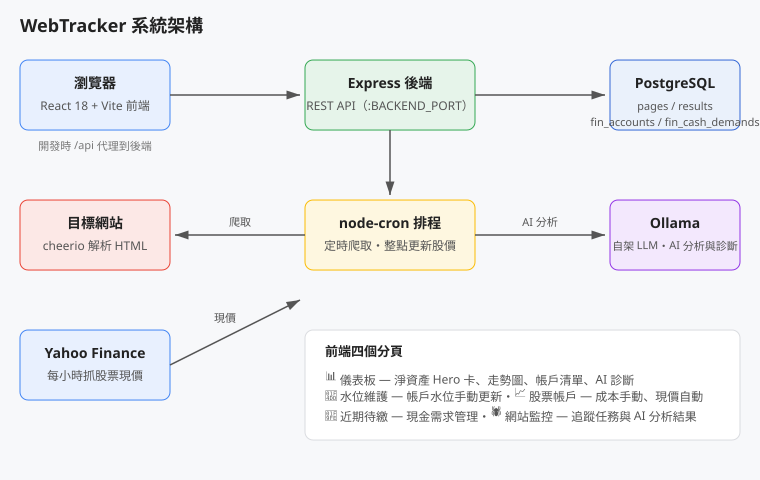

# WebTracker

個人財務儀表板 + AI 網站監控工具：追蹤帳戶水位與股票部位、定時爬取你指定的網頁並用自架 LLM 依你的 prompt 做分析，結果都呈現在同一個手機友善的儀表板上。



## 功能

### 📊 財務儀表板（dashboard）
- 淨資產 Hero 卡＋面積走勢圖，指標可在淨資產／現金／投資之間切換
- 橫滑小卡、流動性橫幅、帳戶清單、近期待繳一覽
- **AI 診斷**：綜合帳戶水位、待繳現金需求與最新網站監控摘要，由 Ollama 生成建議

### 📝 水位維護（maintenance）
- 帳戶卡片點一下展開，大數字輸入框＋ ±1 萬／±10 萬快速鍵
- 每筆帳戶可單獨儲存；未儲存的帳戶顯示橘點提醒
- 有未儲存水位時底部浮出「N 項水位未儲存／全部儲存」列
- 新增帳戶彈窗（手機上為底部抽屜）

### 📈 股票帳戶
- 股票代號、持有股數、**每股成本手動設定**
- **現價每小時整點從 Yahoo Finance 自動更新**，市值＝現價 × 股數
- 損益自動計算（帳戶列顯示損益 %，點開可見現價、成本總額、損益金額）

### 🧾 近期待繳（demands）
- 未來現金需求的新增／刪除，含金額與到期日

### 🕷️ 網站監控（scraper）
- 追蹤任務的新增／編輯／刪除，可依分類（Finance / News / Others）分組
- 每個任務可設定 cron 表達式自動執行，也可手動觸發
- 爬取結果送交 Ollama 依自訂 prompt 分析
- 結果列表在手機上自動轉為卡片式呈現，含 AI 分析摘要預覽與相對時間；觸控按鈕 ≥ 44px、支援 iPhone 瀏海安全區

## 技術棧

| 層 | 技術 |
|---|---|
| 前端 | React 18 + TypeScript，Vite 5 |
| 後端 | Node.js + Express |
| 定時排程 | node-cron（定時爬取、每小時股票現價更新）|
| 資料庫 | PostgreSQL（`pg`，啟動時自動建表）|
| AI 分析 | Ollama（自架 LLM，見 `server/gemini.js`）|
| 股票現價 | Yahoo Finance 非官方 chart API（含 429/5xx 重試）|

## 快速開始

```bash
npm install
```

建立 `.env`：

```
# 資料庫（必填）
DB_HOST=your_db_host
DB_ACCOUNT=your_db_user
DB_PASSWORD=your_db_password
DB_NAME=webtracker

# AI 分析用 Ollama（有預設值，可省略）
OLLAMA_URL=http://your-ollama-host:11434
OLLAMA_MODEL=batiai/gemma4-e4b:q4

# 連接埠（有預設值，可省略）
BACKEND_PORT=8888
FRONTEND_PORT=8080
```

啟動（前端 + 後端同時跑）：

```bash
npm run dev
```

前端：http://localhost:$FRONTEND_PORT，後端 API：http://localhost:$BACKEND_PORT（開發模式下前端經 `/api` 代理到後端）。也可以用 `./Startup.sh` 一鍵啟動（會先釋放 8080 / 8888 連接埠佔用再啟動）。

建置前端：

```bash
npm run build   # tsc + vite build，產出 dist/
```

## API 一覽

### 網站監控

| 方法 | 路徑 | 說明 |
| ---- | ---- | ---- |
| GET | `/api/pages` | 取得所有追蹤任務 |
| POST | `/api/pages` | 新增任務（`url` 必填，`cron_expression` 留空 = 僅手動）|
| PUT | `/api/pages/:id` | 更新任務 |
| DELETE | `/api/pages/:id` | 刪除任務 |
| POST | `/api/pages/:id/crawl` | 手動觸發一次爬取 |
| GET | `/api/results` | 取得分析結果（依爬取時間倒序）|

### 財務

| 方法 | 路徑 | 說明 |
| ---- | ---- | ---- |
| GET / POST | `/api/financials/accounts` | 帳戶清單／新增帳戶 |
| PUT / DELETE | `/api/financials/accounts/:id` | 更新／刪除帳戶 |
| PUT | `/api/financials/accounts/batch/balances` | 批次儲存水位 |
| POST | `/api/financials/stocks/refresh` | 手動觸發股票現價更新 |
| GET | `/api/financials/accounts/:id/history` | 單一帳戶水位歷史 |
| GET | `/api/financials/history/all` | 全帳戶水位歷史（走勢圖用）|
| GET / POST / DELETE | `/api/financials/demands` | 近期待繳清單／新增／刪除 |
| GET | `/api/financials/reports` | AI 診斷報告 |
| POST | `/api/financials/advisor` | 產生一次 AI 財務診斷 |

## 專案結構

```
├── src/               # React + Vite 前端
│   ├── App.tsx        # 主畫面：儀表板／水位維護／近期待繳／網站監控四個分頁
│   ├── main.tsx
│   └── App.css / index.css
├── server/
│   ├── index.js       # Express API
│   ├── database.js    # PostgreSQL 存取（pg，啟動時自動建表）
│   ├── scheduler.js   # node-cron：定時爬取＋每小時整點股票現價更新
│   ├── stock.js       # Yahoo Finance 現價抓取（含重試）
│   ├── gemini.js      # Ollama AI 分析呼叫（分析＋財務診斷）
│   └── migrate.js     # 資料庫遷移
├── docs/images/       # 架構圖
├── Startup.sh         # 一鍵啟動腳本
└── index.html
```

## 備註

- AI 分析與 AI 診斷需要能連線到 `.env` 指定的 Ollama 服務；連不上時相關功能會回傳錯誤訊息。
- 股票現價依賴 Yahoo Finance 非官方 API，程式內建 429 / 5xx 重試，但仍可能受限流影響。
- 後端預設時區為 `America/Phoenix`（可用 `TZ` 環境變數覆寫）。
